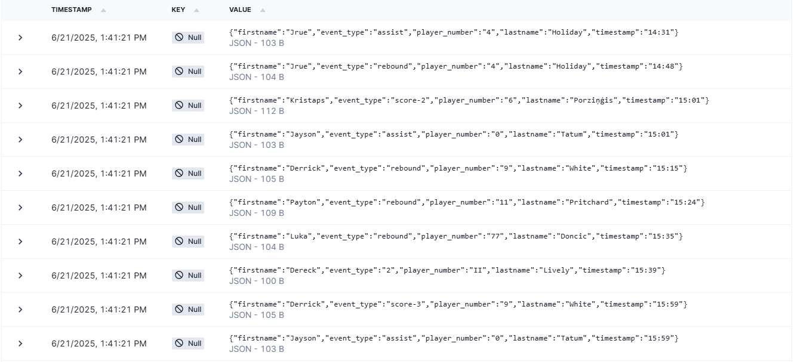

# NBA Game Event Ingest Service

This project is a Spring Boot microservice designed to ingest and process real-time event logs from NBA games. It reads a log file line by line, parses each event, and converts it into a structured JSON format. It also detects time gaps between events.

## Features

- **Line-by-Line Processing**: Reads large log files efficiently using Java Streams without loading the entire file into memory.
- **Dynamic Configuration**: Game log files can be specified using environment variables.
- **JSON Event Parsing**: Translates plain text log entries into structured JSON objects.
- **Time-Gap Detection**: Identifies and logs significant pauses between game events.
- **Built with Spring Boot**: A robust and modern Java framework.

## Project Structure

```
NBA_replay/
├── GameEventIngestService/
│   └── GameEventIngestService/
│       ├── src/
│       │   ├── logs/
│       │   │   └── game1.log   <- Place your game log files here
│       │   ├── main/
│       │   │   └── java/       <- Main application source code
│       │   └── test/
│       ├── pom.xml             <- Maven project configuration
│       └── target/             <- Compiled application (JAR file)
└── README.md                   <- This file
```


## Configuration

The application's behavior is configured in the `src/main/resources/application.properties` file.

```properties
# The base path where game log files are located
game.events.logs.basePath=src/logs

# The filename pattern. Can be overridden by an environment variable.
game.events.logs.filename=${GAME_ID:game1}.log
```

- **`game.events.logs.basePath`**: The directory where the service looks for log files. By default, it's set to `src/logs` within the service directory.
- **`game.events.logs.filename`**: The pattern for the log file name.
    - It uses a default value of `game1.log`.
    - You can override this by setting a `GAME_ID` environment variable.

## How to Run


**Examples:**
```
00:22  Luka Doncic (77) score-2
01:12  P.J. Washington (25) rebound
02:57  Al Horford (42) foul
```

