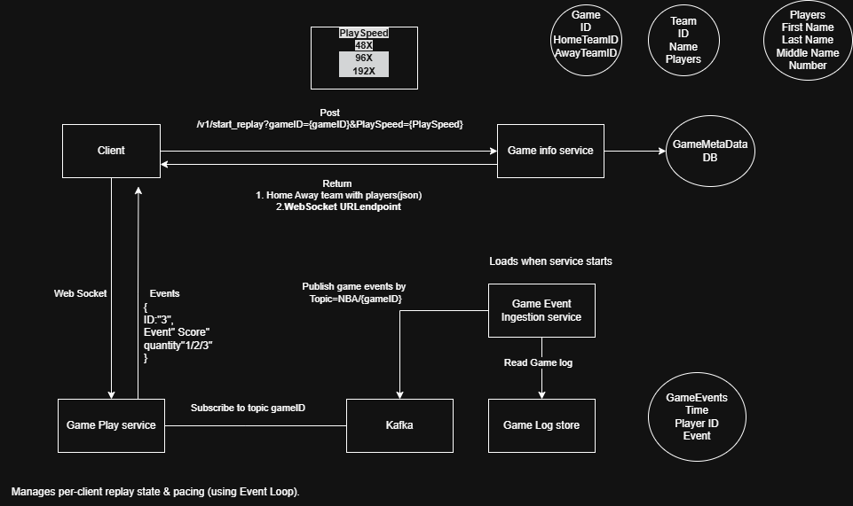

# NBA 即時比賽重播系統


[English](README.md) | [繁體中文](README.zh-TW.md)

一個使用 Spring Boot、Kafka、WebSocket 和現代網頁技術建構的綜合性 NBA 比賽事件重播系統，具有精確的時間控制功能。

## 🏀 系統概覽

本系統允許您以準確的時間、可變的播放速度和即時串流到網頁客戶端的方式重播 NBA 比賽事件。專為體育分析、比賽回顧和教育目的而設計。系統包含完整的微服務架構，具有資料庫管理、即時事件處理和互動式網頁介面。

## ✨ 功能特色

- **🎯 時間基礎重播**: 從任何特定比賽時間開始重播 (MM:SS 格式)
- **⚡ 可變播放速度**: 0.5x 到 96x 速度控制
- **🔄 即時串流**: 基於原始 JSON WebSocket 的即時事件串流
- **📊 事件視覺化**: 在網頁 UI 中即時顯示比賽事件
- **🎮 互動控制**: 從網頁介面開始、停止和控制重播
- **📈 可擴展架構**: 使用 Kafka 的事件驅動微服務
- **🐳 Docker 支援**: 完整的容器化部署
- **🔍 Kafka 管理**: 內建 Redpanda Console 用於主題監控
- **🏠 比賽資訊服務**: 完整的 NBA 球隊和球員資料庫
- **📱 現代網頁介面**: 基於 React 的前端，使用 Tailwind CSS

## 🏗️ 系統架構

系統使用微服務架構，包含以下元件：



```
┌─────────────────┐    ┌──────────────────┐    ┌─────────────────┐
│   比賽事件      │    │      Kafka       │    │   重播          │
│   攝取服務      │───▶│      代理        │───▶│   服務          │
│                 │    │                  │    │                 │
└─────────────────┘    └──────────────────┘    └─────────────────┘
                                │                        │
                                ▼                        ▼
                       ┌──────────────────┐    ┌─────────────────┐
                       │  Redpanda        │    │   網頁 UI       │
                       │  Console         │    │   (WebSocket)   │
                       └──────────────────┘    └─────────────────┘
                                │
                                ▼
                       ┌──────────────────┐
                       │  比賽資訊        │
                       │  服務            │
                       │  (前端/          │
                       │   後端)          │
                       └──────────────────┘
```

### 元件說明

1. **比賽事件攝取服務**: 將比賽資料載入 Kafka 主題
2. **Kafka 代理**: Apache Kafka 用於事件串流和儲存
3. **重播服務**: Spring Boot 服務，消費事件並管理重播時間
4. **比賽資訊服務**: 包含球隊、球員和比賽資訊的完整 NBA 資料庫
5. **網頁 UI**: 用於控制和檢視重播的 HTML/JavaScript 介面
6. **Redpanda Console**: 基於網頁的 Kafka 管理介面

## 🎬 系統演示

觀看系統實際運作：


📹 **[觀看完整演示影片](docs/result_demo_v1.mp4)** - 觀看即時 NBA 比賽重播系統的實際運作，包含可變播放速度和精確時間控制。

## 🚀 快速開始

### 前置需求

- Docker 和 Docker Compose
- Java 17+ (本地開發用)
- Maven (本地開發用)

### 1. 啟動系統

```bash
# 複製儲存庫
git clone <repository-url>
cd NBA_replay

# 啟動所有服務
docker-compose up -d
```

### 2. 存取服務

- **比賽資訊前端**: http://localhost:3000
- **比賽資訊後端 API**: http://localhost:8082
- **重播網頁 UI**: http://localhost:8000/test-time-replay.html
- **Kafka Console**: http://localhost:8080
- **重播服務 API**: http://localhost:8081/api/health
- **資料庫**: localhost:5432

### 3. 測試重播

1. 在瀏覽器中開啟重播網頁 UI
2. 點擊「連接」建立 WebSocket 連線
3. 設定開始時間 (例如 "00:00") 和速度 (例如 "5.0x")
4. 點擊「開始重播」開始播放
5. 觀看事件以正確的時間即時串流

## 📋 詳細設定

### Docker Compose 服務

系統包含以下服務：

#### 資料庫 (PostgreSQL)
- **埠號**: 5432
- **用途**: 儲存 NBA 球隊、球員和比賽資訊
- **資料庫**: nba
- **初始化**: 自動載入範例資料

#### 比賽資訊服務
- **前端埠號**: 3000 (React 應用程式)
- **後端埠號**: 8082 (Spring Boot API)
- **用途**: 完整的 NBA 資訊管理系統
- **功能**: 球隊管理、球員檔案、比賽統計

#### Kafka 代理
- **埠號**: 9092 (外部), 19092 (內部)
- **用途**: 事件串流和儲存
- **設定**: 單節點設定，3 個分區

#### 比賽事件攝取服務
- **用途**: 將 NBA 比賽資料載入 Kafka 主題
- **主題**: `nba-finals-game1`
- **資料來源**: Basketball Reference 逐球資料

#### 重播服務
- **埠號**: 8081
- **用途**: 管理重播時間和 WebSocket 串流
- **功能**: 時間基礎重播、速度控制、原始 JSON WebSocket
- **WebSocket 端點**: `ws://localhost:8081/ws/replay`

#### Redpanda Console
- **埠號**: 8080
- **用途**: 基於網頁的 Kafka 主題管理
- **功能**: 主題瀏覽、訊息檢查、消費者監控

#### 重播 UI
- **埠號**: 8000
- **用途**: 重播控制的網頁介面
- **功能**: 即時事件顯示、重播控制、狀態監控

### 環境變數

```bash
# 資料庫設定
POSTGRES_DB=nba
POSTGRES_USER=postgres
POSTGRES_PASSWORD=postgres

# Kafka 設定
KAFKA_URL=kafka:19092
KAFKA_TOPIC=nba-finals-game1

# 服務設定
GAME_ID=game1
```

## 🎮 使用指南

### 比賽資訊服務

比賽資訊服務提供完整的 NBA 資訊管理系統：

- **球隊**: 檢視所有 NBA 球隊的詳細資訊
- **球員**: 瀏覽球員檔案和統計
- **比賽**: 存取比賽資料和結果
- **儀表板**: 系統概覽和分析

### 重播服務

#### 網頁 UI 控制

**連線**
- **連接**: 建立與重播服務的 WebSocket 連線
- **斷線**: 關閉 WebSocket 連線
- **清除事件**: 清除事件顯示

**重播控制**
- **開始時間**: 開始重播的比賽時間 (MM:SS 格式)
- **播放速度**: 重播速度倍數 (0.5x 到 96x)
- **開始重播**: 從指定時間開始重播
- **停止重播**: 停止目前重播

#### 速度選項
- **0.5x**: 慢動作重播
- **1.0x**: 正常速度
- **2.0x**: 快轉
- **5.0x**: 非常快
- **10.0x**: 超快
- **20.0x**: 閃電速度
- **48.0x**: 瞬間重播
- **96.0x**: 閃光速度

### API 端點

#### 健康檢查
```bash
curl http://localhost:8081/api/health
```

#### 服務狀態
```bash
curl http://localhost:8081/api/status
```

### WebSocket 指令

重播服務使用原始 JSON WebSocket (無 STOMP 協定)：

#### 開始重播
```json
{
  "action": "start_replay",
  "startTime": "05:00",
  "speed": 1.0
}
```

#### 停止重播
```json
{
  "action": "stop_replay"
}
```

#### 取得狀態
```json
{
  "action": "get_status"
}
```

## 🔧 開發

### 本地開發設定

1. **啟動基礎設施服務**:
   ```bash
   docker-compose up db kafka redpanda-console -d
   ```

2. **本地執行服務**:
   ```bash
   # 重播服務
   cd ReplayService
   ./mvnw spring-boot:run
   
   # 比賽事件攝取服務
   cd GameEventIngestService
   ./mvnw spring-boot:run
   
   # 比賽資訊後端
   cd GameInfoService/backend
   ./mvnw spring-boot:run
   
   # 比賽資訊前端
   cd GameInfoService/frontend
   npm install
   npm start
   ```

3. **本地提供重播 UI**:
   ```bash
   cd ReplayService
   python -m http.server 8000
   ```

### 建置 Docker 映像

```bash
# 建置重播服務
cd ReplayService
docker build -t replay-service .

# 建置比賽事件攝取服務
cd GameEventIngestService
docker build -t game-event-ingest-service .

# 建置比賽資訊服務
cd GameInfoService/backend
docker build -t gameinfo-backend .

cd GameInfoService/frontend
docker build -t gameinfo-frontend .
```

### 專案結構

```
NBA_replay/
├── docker-compose.yml              # 主要編排
├── GameEventIngestService/         # 資料攝取服務
│   ├── src/main/java/
│   ├── Dockerfile
│   └── pom.xml
├── ReplayService/                  # 重播管理服務
│   ├── src/main/java/
│   ├── test-time-replay.html      # 重播網頁 UI
│   ├── test-websocket.html        # WebSocket 測試 UI
│   ├── Dockerfile
│   └── pom.xml
├── GameInfoService/                # NBA 資訊服務
│   ├── backend/                    # Spring Boot API
│   ├── frontend/                   # React 應用程式
│   ├── init.sql                    # 資料庫初始化
│   └── README.md
└── docs/                          # 文件
    ├── API_DOCUMENTATION.md
    ├── DEPLOYMENT_GUIDE.md
    └── real-time-NBA-architecture.drawio.png
```

## 📊 資料格式

### 比賽事件結構

```json
{
    "firstname": "Luka",
    "lastname": "Doncic",
    "event_type": "score-2",
    "player_number": "77",
    "timestamp": "00:22"
}
```

### 事件類型

- `score-2`: 兩分球
- `score-3`: 三分球
- `free-throw`: 罰球
- `rebound`: 籃板
- `assist`: 助攻
- `foul`: 犯規
- `turnover`: 失誤
- `steal`: 抄截
- `block`: 阻攻

## 🔍 監控和除錯

### Kafka Console

在 http://localhost:8080 存取 Redpanda Console 以：
- 瀏覽主題和分區
- 檢查訊息
- 監控消費者群組
- 檢視主題統計

### 服務日誌

```bash
# 檢視所有服務日誌
docker-compose logs -f

# 檢視特定服務日誌
docker-compose logs -f replay-service
docker-compose logs -f game-event-ingest-service
docker-compose logs -f gameinfo-backend
docker-compose logs -f gameinfo-frontend
```

### 健康檢查

```bash
# 檢查重播服務健康狀態
curl http://localhost:8081/api/health

# 檢查比賽資訊後端健康狀態
curl http://localhost:8082/api/health

# 檢查服務狀態
curl http://localhost:8081/api/status
```

## 🐛 故障排除

### 常見問題

#### WebSocket 連線失敗
- **原因**: 重播服務未執行或埠號錯誤
- **解決方案**: 檢查服務日誌並確保埠號 8081 可存取

#### 無事件顯示
- **原因**: Kafka 主題為空或消費者問題
- **解決方案**: 檢查 Kafka console 並確保比賽資料已載入

#### 重播時間問題
- **原因**: 時鐘格式不匹配或偏移計算錯誤
- **解決方案**: 驗證比賽時間格式 (MM:SS) 並檢查服務日誌

#### 資料庫連線問題
- **原因**: PostgreSQL 容器不健康
- **解決方案**: 檢查資料庫日誌並確保正確初始化

#### Docker 建置失敗
- **原因**: 缺少 Maven wrapper 檔案或 npm 依賴
- **解決方案**: 確保 Docker 上下文中存在所有必要檔案

### 除錯指令

```bash
# 檢查 Kafka 主題
docker exec -it kafka kafka-console-consumer.sh \
  --bootstrap-server localhost:9092 \
  --topic nba-finals-game1 \
  --from-beginning

# 檢查服務連線性
docker exec -it replay-service curl localhost:8081/api/health

# 檢視主題分區
docker exec -it kafka kafka-topics.sh \
  --bootstrap-server localhost:9092 \
  --describe --topic nba-finals-game1

# 檢查資料庫
docker exec -it nba-postgres psql -U postgres -d nba -c "SELECT COUNT(*) FROM teams;"
```

## 📈 效能

### 最佳化技巧

1. **批次處理**: 事件以批次處理以提高效率
2. **偏移管理**: 線性搜尋以獲得可靠的開始位置
3. **記憶體管理**: 事件以串流方式處理而非完全載入
4. **連線池**: WebSocket 連線有效管理
5. **資料庫索引**: 對頻繁查詢的欄位建立適當索引

### 擴展考量

- **Kafka 分區**: 目前 3 個分區，可增加以提高吞吐量
- **消費者群組**: 多個重播服務可並行執行
- **WebSocket 連線**: 多個客戶端可同時連線
- **資料庫**: 可透過讀取複本擴展以應對高流量場景

## 🔄 最近更新

### WebSocket 實作
- **從 STOMP 切換到原始 JSON WebSocket**: 簡化通訊協定
- **新增 JsonWebSocketHandler**: 用於直接 JSON 訊息處理的自訂處理器
- **改善錯誤處理**: 更好的錯誤報告和確認回應
- **增強狀態更新**: 即時重播狀態和時間資訊

### 服務架構
- **新增比賽資訊服務**: 完整的 NBA 資訊管理系統
- **增強資料庫**: 具有全面 NBA 資料的 PostgreSQL
- **改善前端**: 基於 React 的介面，使用 Tailwind CSS
- **更好的文件**: 全面的 API 和部署指南

## 🤝 貢獻

1. Fork 儲存庫
2. 建立功能分支
3. 進行您的變更
4. 如果適用，新增測試
5. 提交 pull request

## 📄 授權

本專案採用 MIT 授權條款。

## 🙏 致謝

- 資料來源自 [Basketball Reference](https://www.basketball-reference.com/)
- 使用 Spring Boot、Apache Kafka、WebSocket、React 和 PostgreSQL 建構
- 架構靈感來自即時體育分析系統 